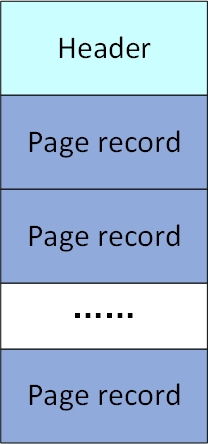
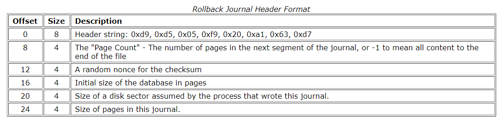

## Rollback journal

#### 简介

&emsp;&emsp;sqlite的日志模式有两种，分别是回滚式日志rollback journal和预写式日志wal(write ahead log). 在回滚式日志模式中，sqlite会将事务更新前的数据行写入到回滚式日志文件中，然后再更新数据库文件中的数据行，如果更新失败，则利用回滚式日志文件中的数据对数据进行恢复。

&emsp;&emsp;sqlite的回滚式日志文件名与数据库文件名类似，回滚式日志文件名在数据库文件名之后追加了'-journal'

对于回滚式日志文件的处理，sqlite分为5种模式

- **DELETE**

  在该模式下，事务结束后日志文件会被删除

- **TRUNCATE**

  在该模式下，事务结束后日志文件长度会被截断为0，在一些系统中，截断文件比删除文件更快

- **PERSIST**

  在该模式下，事务结束后日志文件会保留，但文件头会用0填充以标示无效

- **MEMORY**

  在该模式下，日志信息保留在内存中，系统崩溃可能导致日志文件丢失

- **OFF**

  在该模式下，回滚式日志被禁用，sqlite不再保证事务的原子性，回滚命令失效

#### 文件结构

&emsp;&emsp;一个日志文件有文件头和多条日志记录组成，结构如下图所示

&emsp;&emsp;日志文件的文件头格式如下

