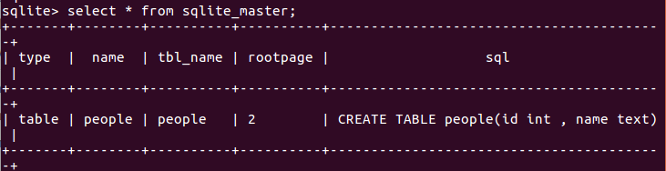

## 执行引擎（VDBE）

#### 概述

&emsp;&emsp;vdbe位于sqlite架构的中间，sql语句经parser等处理后生成相应的vdbe指令，vdbe会执行这些指令并完成相应的功能，对应的是vdbe.c中的int sqlite3VdbeExec(Vdbe *p)这个函数，Vdbe结构体包含了执行的指令及其上下文信息。

#### 指令格式

&emsp;&emsp;vdbe是基于寄存器的虚拟机，每条指令会有5个操作数，有些操作数可能不会使用到。P1,P2,P3通常指向寄存器。

- 对于需要使用b-tree游标的指令，P1是对应的游标编号
- 对于跳转指令，P2往往是跳转的地址
- P4可能是32位的有符号整数，64位有符号整数，64位浮点数，字符串，blob literal，一个指向排序序列比较函数的指针，一个指向应用定义的sql函数的指针等等
- P5是一个16位无符号整数，通常存储flag，会对指令的行为造成影响

&emsp;&emsp;vdbe一共有176个操作指令，源码文件也比较大，方便起见我只分析vdbe中简单的单表查询操作。利用explain命令可以查看sql语句对应的虚拟机指令。为了方便，只考虑针对单表的简单指令。

&emsp;&emsp;在sqlite中，我建立了一个people表，只有两个字段，id(int)和name(text)。接下来的操作都针对people表。

- ###### 单表查询

  在people中查询数据，sql语句为`select * from people`

  利用explain指令查看生成的字节码指令，如下图

  

  逐条分析虚拟机指令

  - **Init**  

    Init是程序的第一条指令，当P2不为0时，会跳转到P2对应的指令，并令P1=P1+1

    

    Init指令的最后会跳转到jump_to_p2，在该部分会将指令指针pOp置为第P2-1条指令，也就是第8条指令，退出switch结构后，在for循环部分，pOp会加1，即下一次循环要执行的指令的是第9条指令

    

  - **Transaction**

    该指令会在P1对应的数据库上开启事务，P1是数据库文件对应的标号，P1=0代表主数据库文件，P1=1代表临时表文件，P1>1代表附加的数据库。由于我们的数据库文件中仅有main数据库，所以P1为0。

    P2为0，将开启读事务，P2不为0，将开启写事务，由于我们是读取数据，所以P2=0

    当P5!=0时，会检查数据库的schema。

    在Transaction中，会先利用数据库对应的b树指针，并在

    `int sqlite3BtreeBeginTrans(Btree *p, int wrflag, int *pSchemaVersion)`

    中开启事务，当wrflag为0时，表示读事务。

  - **TableLock**

    

  

- ###### 单表插入

- ###### 单表更新

- ###### 单表删除

