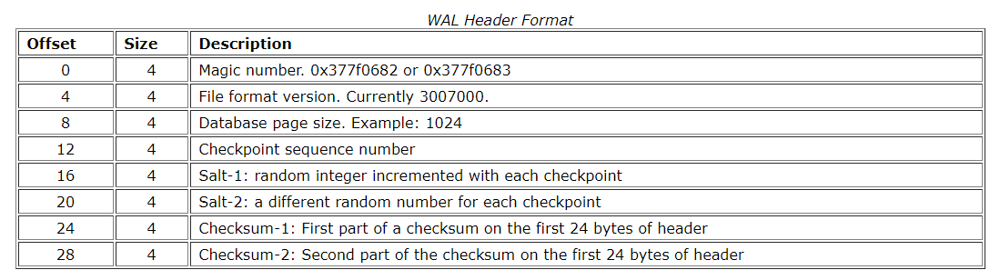
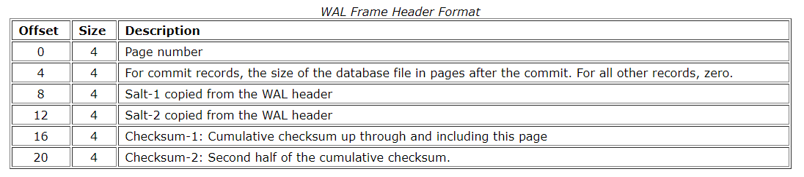

## Write ahead log

#### 简介

&emsp;&emsp;sqlite的日志模式有两种，分别是回滚式日志rollback journal和预写式日志wal(write ahead log). 在预写式日志中，sqlite会将更新后的页面数据写入到wal日志中，等到合适的时候再将日志中的内容同步到数据库文件中。

#### 文件结构

&emsp;&emsp;wal日志文件的结构与回滚式日志类似，由日志头和多个页面记录(Frame)组成。

&emsp;&emsp;wal文件头大小为32字节，由8个32bit的大端无符号整数值组成

&emsp;&emsp;紧跟着文件头之后的是多个frame，frame由frame header和page数据组成。frame头结构如下

###### 参考资料

1. [Sqlite file format](https://www.sqlite.org/fileformat.html)
2. [wal index file](https://www.sqlite.org/walformat.html)